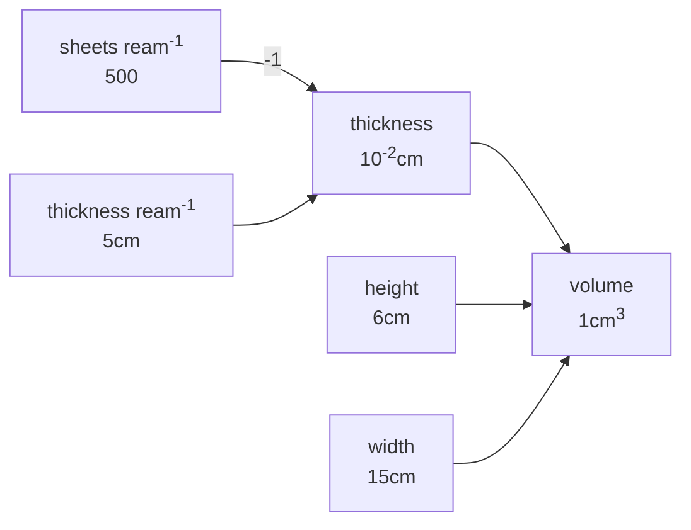
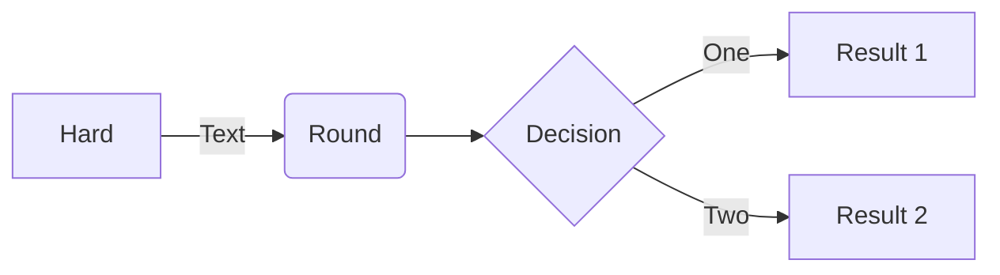
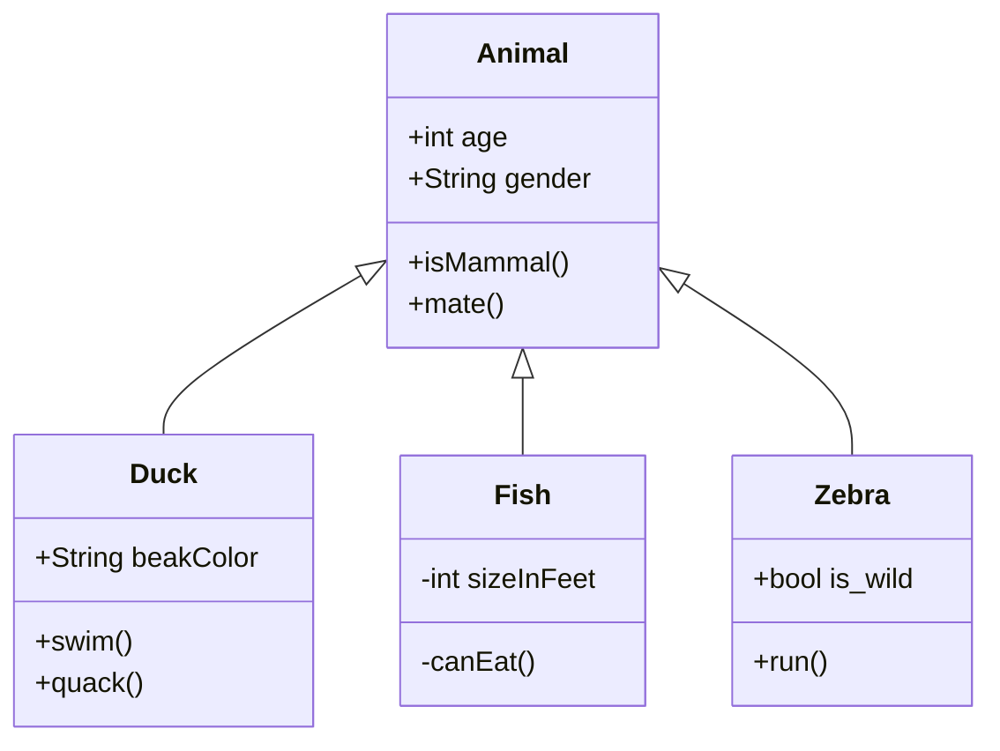
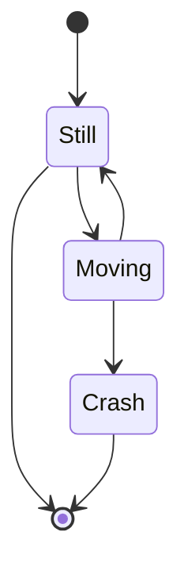
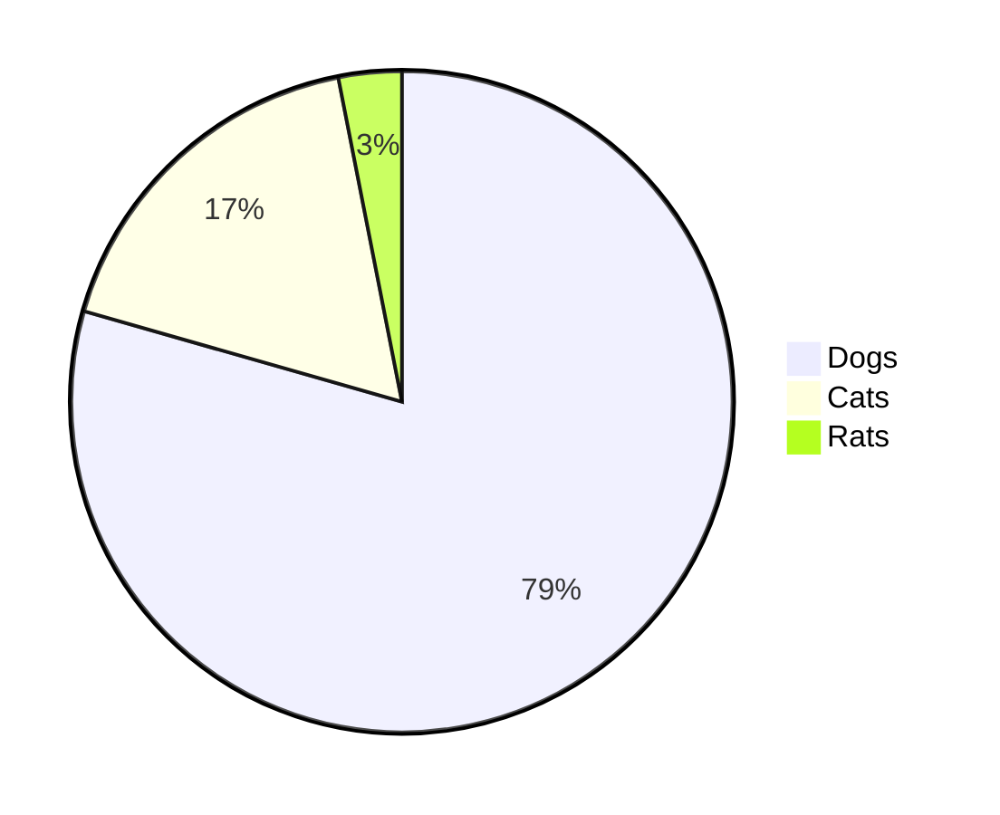
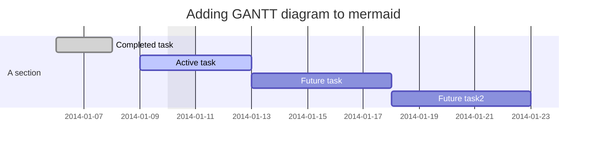

## Implementation v1

This is an explanatory note about how I implemented Mermaid on my site with the Hermit theme. Hermit doesn't have a partials layout for javascript like some other themes, it does its javascript processing in `baseof.html` (a refactoring opportunity there) so I took some cues from Edward Ross' [implementation](https://skeptric.com/diagrams-in-hugo/) mainly his shortcode and his graph test just for an example. The main implementation of `partials/mermaid.html` is simply

~~~ html
{{ $mermaid := resources.Get "js/mermaid.min.js" }}                                                                                                                          
{{ $secureJS := $mermaid | resources.Fingerprint "sha512" }}                                                                                                                 
<script crossorigin= "anonymous" defer="defer" type="text/javascript" src="{{ $secureJS.Permalink }}" integrity="{{ $secureJS.Data.Integrity }}"></script>                   
<script>                                                                                                                                                                     
  var config = {                                                                                                                                                           
    startOnLoad:true,
    securityLevel: 'loose',
  };
  mermaid.initialize(config);
</script>
~~~

From there, I just put `{{ partial "mermaid.html" }}` in `baseof.html` and the implementation was complete. Note that I used the property `Permalink` rather than `RelPermalink` because the theme is set up that way.

## Implementation v2

Now with the new 0.93.0 diagram backend processing, I can support mermaid diagrams in a more markdown-native way. To do so required only a little more work. First, I removed the `{{ partial "mermaid.html" }}` from `baseof.html`. Unfortunately while this is much more convenient here, in order for the method suggested by Hugo, it can be activated where needed by page templates instead. We can leave the shortcodes and the partials where they are though!

As the [example](https://gohugo.io/content-management/diagrams/) shows, I can make a new code snippet under `layouts/_cefault/_markup/` as `render-codeblock-mermaid.html`. The name is important, Hugo parses that, whatever your diagram language is called, it could be `render-codeblock-jelly.html` and any markup with \`\`\`jelly will be interpreted as `jelly` markup.

Now I've added, in the place suggested after `.Content` to each `single.html` snippet in my `layouts` tree the following simple piece:
~~~ html
  {{ if .Page.Store.Get "hasMermaid" }}
    {{- partial "mermaid.html" }}
  {{ end }}
~~~

As page templates only differ between post-style or article-style in the hermit theme, this is quickly achieved, and I've already encapsulated the difficult part of the code. And we can keep the shortcode, athough it does require the partial to be activated somewhere.

## basic graph test


## flowchart test


## class diagram


## state diagram


## pie chart


## gantt diagram



## git graph (experimental)

This doesn't work too well within the contraints of my theme, and the computed svg cannot be controlled directly by design so it's not likely to be a popular variant despite there being a use case for it. It's better to generate an actual image in this case instead of on-the-fly-generation.





<br>
<br>
<br>


## user journey diagram

This one is my favourite, I think 

```mermaid
journey
  title My working day
  section Go to work
  Make tea: 5: Me
  Go upstairs: 3: Me
  Do work: 1: Me, Cat
  section Go home
  Go downstairs: 5: Me
  Sit down: 5: Me
  ```
