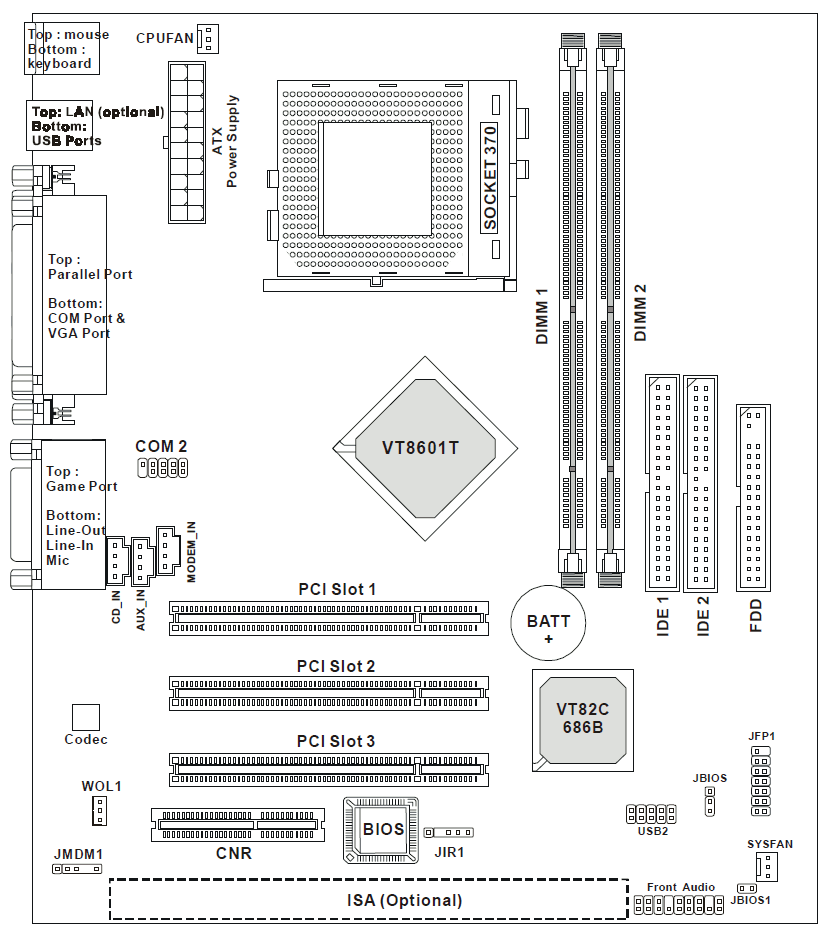
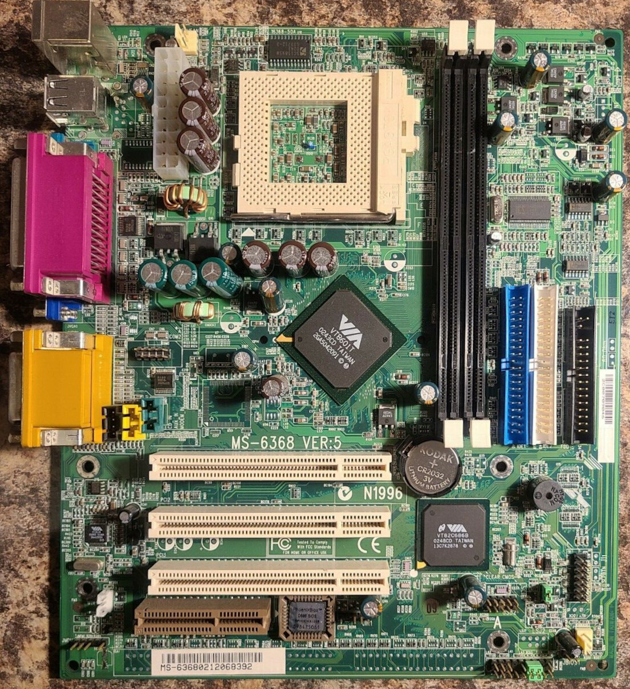
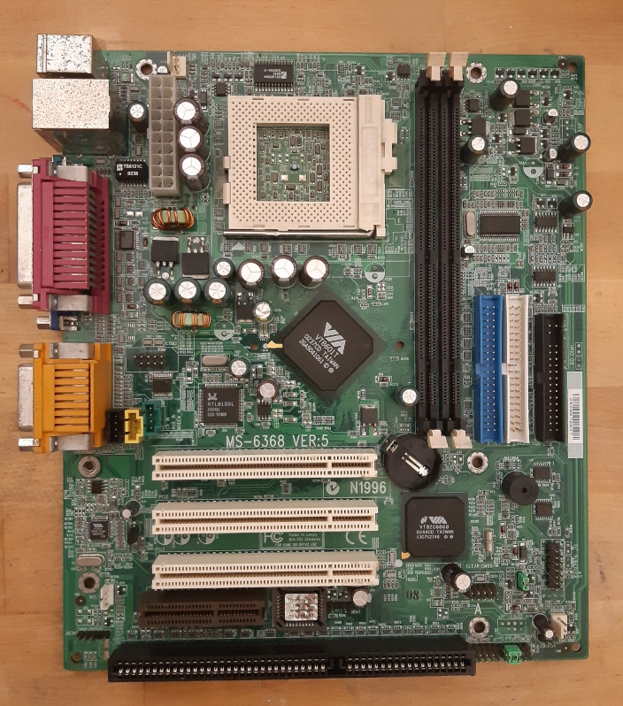
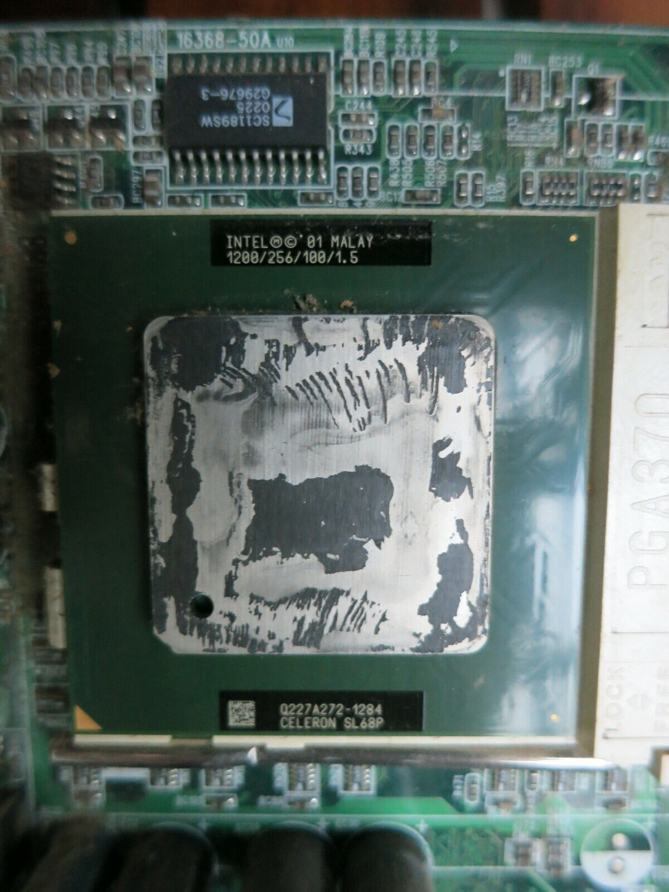
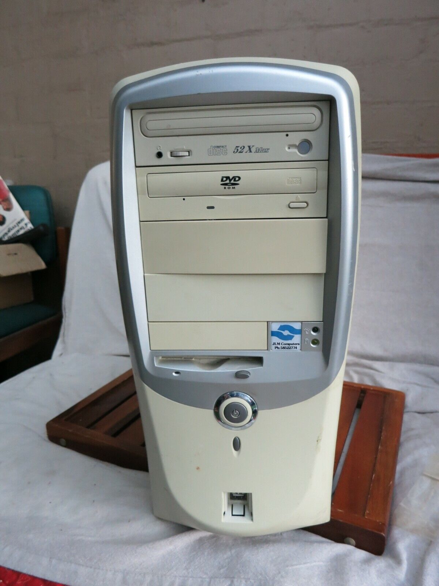
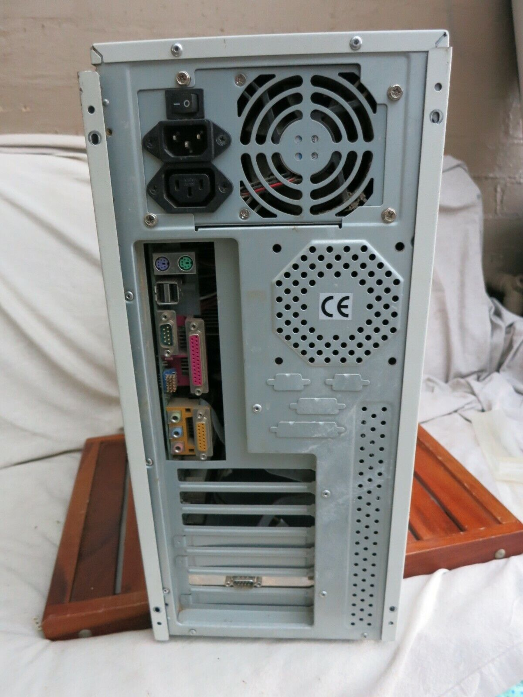
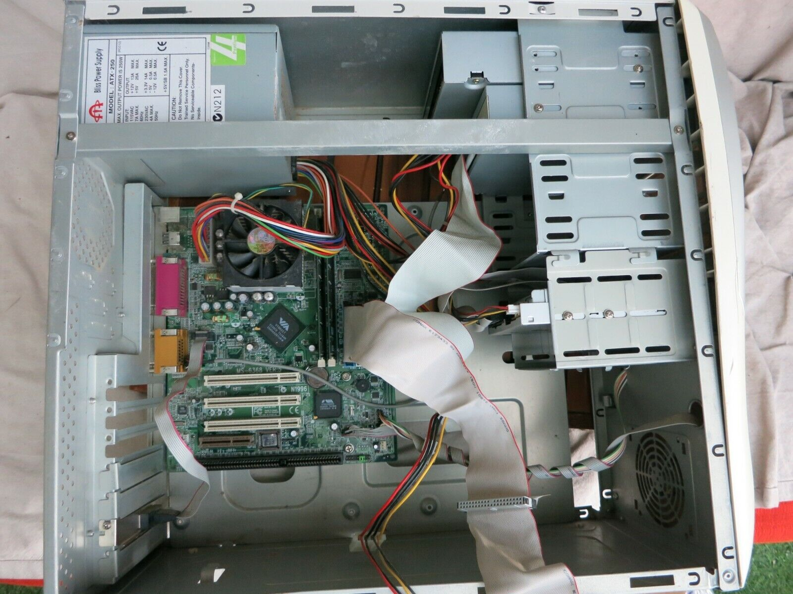

## Introduction

Here is a classic beigebox from the beginning of the 2000's, the heyday of the Pentiums. It is tricky to classify machines like this so I went from the processor to the board name, chipset and roughly the year of manufacture. I bought this on ebay, listed as for parts/not working, the seller clearly didn't want to test it and mined it for parts and didn't examine it very closely. They took steps to hide the value of the RAM, possibly because it was brand-mismatched and only totaled 512mb. It was also obvious they had taken the HDD and cards out and possibly changed the processor. 

## Motherboard

The original board is an MSI MS-6368 Micro-ATX Ver 5 supporting a VIA VT8601T chipset and a VT686B southbridge, Variations of the board has an optional ISA slot which this board has and an optional LAN header which this board *does not* have. The integrated VGA port is damaged so in addition to the NIC I have also had to supply a video card, which is just as well since these boards typically chew up RAM for the integrated chipsets.

Motherboard diagram: 

Original Motherboard: 

Replacement Motherboard: 

If you compare the photos, you'll see the LAN chip next to the main chipset and the taller stack next to the ATX power jack, indicating an RJ45 port.
 

## Processor

Notice that no attempt was made to hide that there was no thermal paste.I suspect this may have been changed from the original. It might explain the lack of thermal paste (obviously previously adhesive paste on it), because there was no adhesive paste damage on the cooler as well. It also explains why they would put a relatively rare Celeron processor, a SL68P Tualatin 1.2 Ghz Celeron (worth far more than the box itself) in there, if they were getting a more expensive processor out (like a p3).: 

## Notes
This board supports the kingly maximum of 1GB! The seller took pains to hide the true amount of RAM (presumably so he could minimize it because cheating customers is common on ebay) but it was just 2x256MB of mismatched brands.  Seller also claimed the psu works but nothing else did and took the heatsink off the processor and didn't reapply thermal paste.  I put in a temporary drive and replaced the RAM with 2x512mb RAM and did a quick POST which seemed to work. I then removed the heatsink and it was just as I suspected, no thermal paste. Unfortunately, in the process, I damaged the motherboard and now it will not POST, I mashed some tiny SMT components which are in a horribly designed place in front of the processor next to the RAM slots. Definitely a "setup outside of the box very carefully" design. Fortunately I can source a replacement motherboard that will have a integrated LAN and working VGA header.

I have a replacement 600Mhz Celeron coming, which might be better for some games but this processor is worth keeping. Also there did seem to be no cards in the box but I'm betting there *used* to be. So it'll be very interesting to see what's there. 2x optical drives, a floppy and no hard drive. Does any of it work? Who knows? I have a Matrox Millenium VGA card and a 4GB Maxtor drive waiting for it. I might upgrade to a G200 later. 

## Photo Gallery

Original listing photos, from left to right, front, back, internal view.

 

