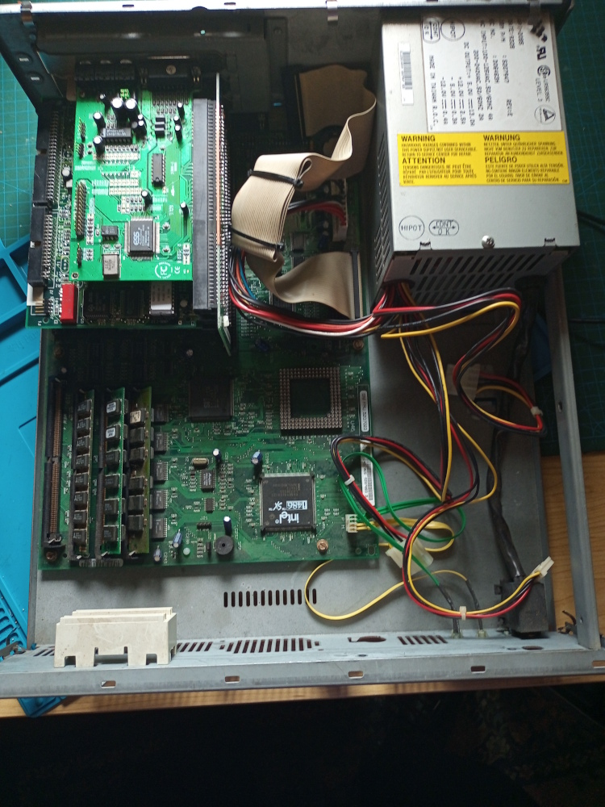
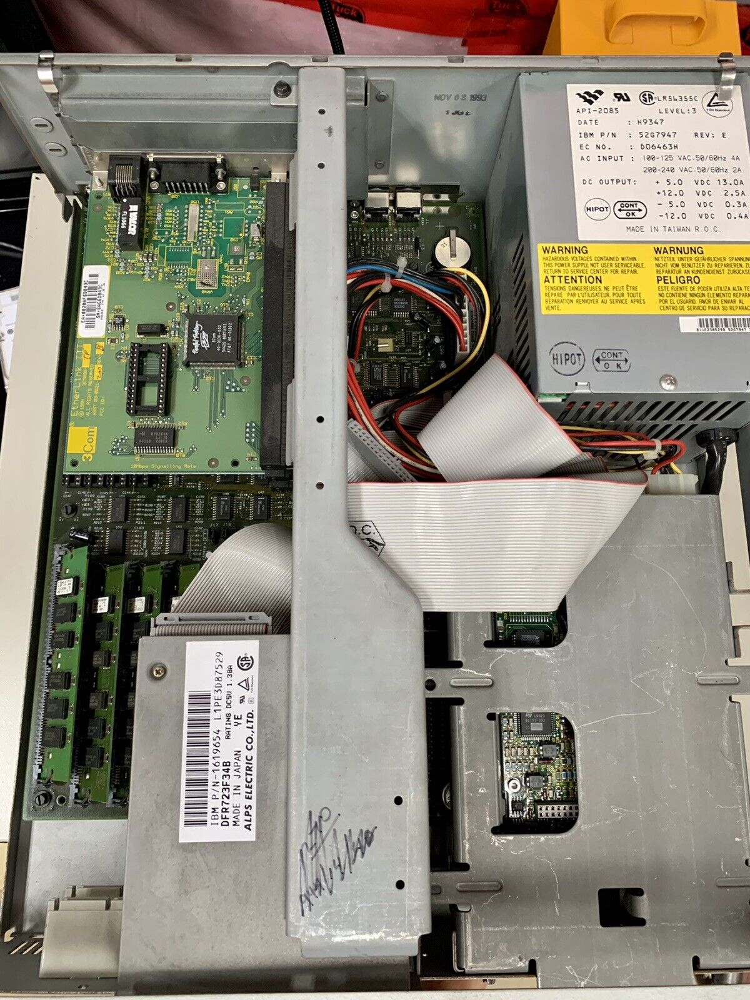
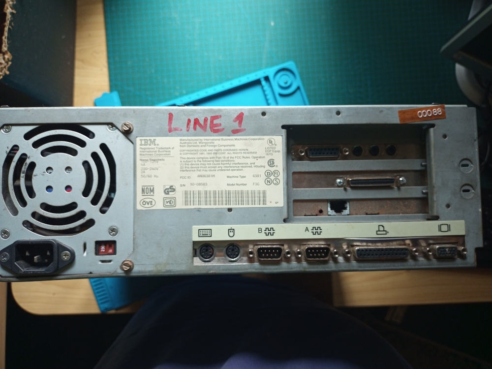
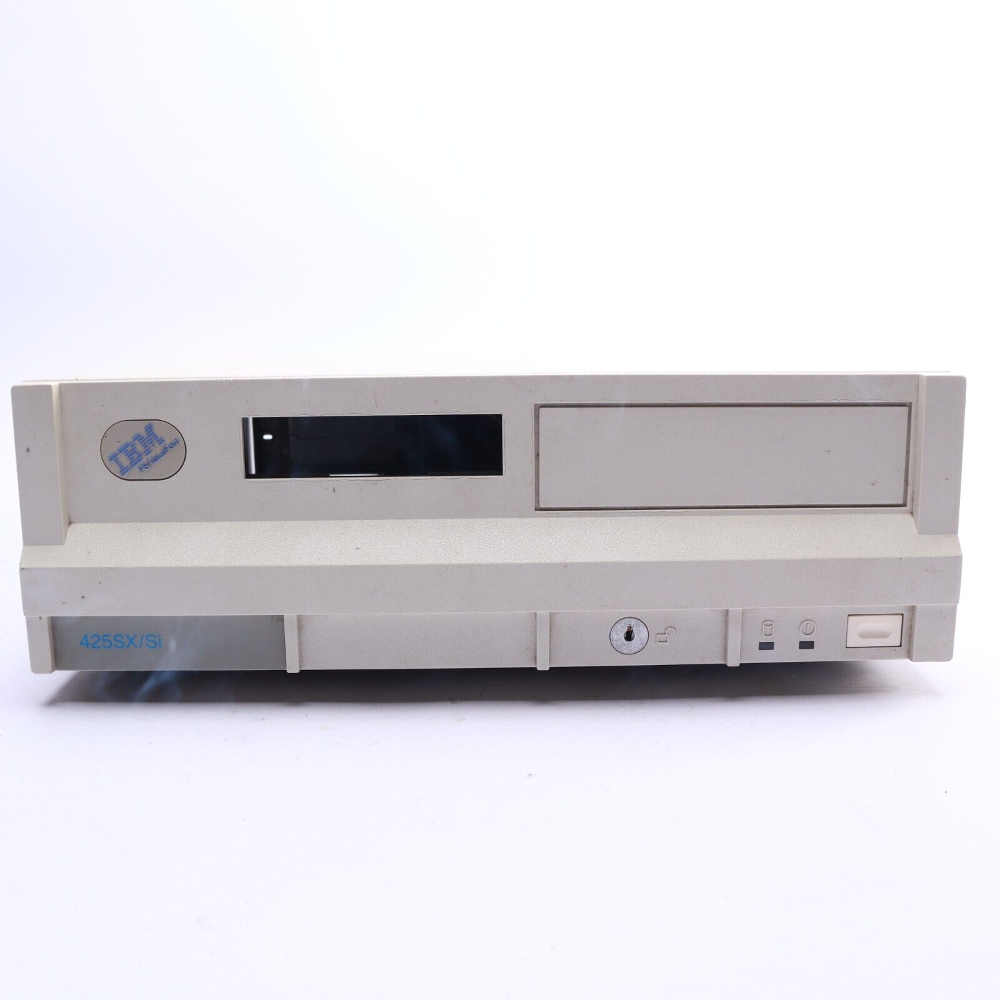
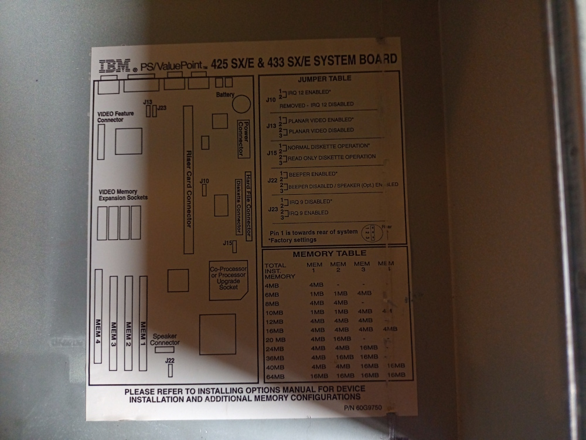

## Introduction

The IBM PS&#47;Valuepoint family was the generation between the PS/2 and the PC 300 series. IBM broke with its previous proprietary hardware and used commodity hardware which brought down prices and made their machines a lot more appealing to the market.

## Specifications

This 6381 is a F30 model, the F30 seems to apply to models 6381,6382, and 6384 all of which are sx/25Mhz systems. It has 3 ISA slots.  This specific model model shares a lot of characteristics with my old Packard Bell, having a 32bit bus video chip on the board and upgradable video memory but a bit slower at 25Mhz. It did have the extraordinary ability to be upgraded to a total of 64MB of RAM and came with 8MB RAM standard which was very high-end for the day, although the standard HDD was only 170MB compared to the PB's 210MB. It also came with a 2x CD-ROM, which is a little backward at this time when 4x CD-ROMS were being sold by their competitors but the 425SX/Si was the budget line, with a Cirrus Logic GD5428 video chipset compared to the Tseng Labs ET4000/W32 of the DX machines in the line.

## I/O Cards

Three slots are currently filled with:

* 3com Etherlink III network card, best supported DOS networking card.
* ESS1868F sound card, good Adlib and Soundblaster clone.
* Adaptec AHA1549CP SCSI card (optional)

# Issues and Options

The primary problem with this retro box is physical: It lacks the central brace that stabilizes the I/O card riser and provides slots for the drive cages to hook into, and of course the drive cages themselves. Until I can source these parts, this box is very much incapable of being a working system.

The SCSI card gives me the option of adding an extra HDD or CD-ROM, and possibly avoid some issues due to the age of the system. Most of my available IDE drives are very large, although I do have a 1990's vintage hard drive that might work as is. Otherwise the slot will necessarily have to be filled by an XTIDE ROM that overrides the system rom to enable the use of much larger HDDS and floppys. There is a good chance this won't work on the Valuepoint though. The BIOS chip isn't removable or an eeprom model in the sense later beige boxes designs were. IBM hadn't gone that far towards market compatibility yet! Until I get the right drive to test it with, the SCSI BIOS has been failing POST, the 1990's drive was recognised but the SCSI BIOS thought it was defective.

## Other options

* Overdrive processor in the coprocessor slot. It actually doesn't matter too much what speed although it's probably unwise to go too far. A DX2-75 is known to work fine in an SX-25 system, so a DX2-66 *might* work although that's not a good multiple of the bus speed. Look for a 50 or 75. The processor will shut off the sx-25 anyway.
* 5.25" drive. But this requires me to have a working brace and cage which I do not yet have and this may be a long time coming. Do try to get a working 5.25" drive anyway for another box. 
* Gotek floppy drive emulator. This is the other alternative, to emulate floppy images, but that doesn't solve the problem I have of the disks I have needing to be imaged before they disintegrate.

## Current Status

Ultimately the Valuepoint is a backburner 486 option I feel. I will probably have to wait years to complete it and I want to find another 486 machine for my retro needs. 

## Photo Gallery

Current inside view of this valuepoint: 

View of an intact valuepoint for comparison: 

Back and front of the valuepoint (front photo is from the ebay listing) : 

Interesting and useful diagram of important motherboard components on the inside of the cover: 

