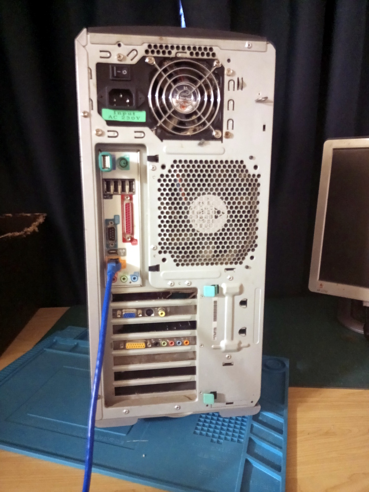

## Introduction

This machine is is now vintage by virtue of a number of its characteristics, not simply by age:

* 32bit Processors. This limits their instruction set, virtual memory and other features. For instance, they have no idle bit (hence the power-hungry), no virtualization, their standard model L1 cache is tiny at 512kb (HP only offered 1MB L1 cache on later models) but they have a bigger L3 cache.
* Memory limitation to 32GB but also HDD size and partition size limitations. RAID might be fun to do but be careful.
* Outdated PCI specifications. Old PCI-X slots are here! You only see these on old server machines usually so to see them on a machine once marketed to small business is quite wild. But they were to seriously run databases and hold important data and (hopefully) run backups too. I've only seen HDD controllers and network cards fill these slots which is a bit redundant when the board also integrates the same things. But some cards do that job a lot better.
* No actual SATA controller. This is where the one SATA controller card I *do* have is useful, particularly with the PSU that has all the SATA power outputs!

This is an ex-Defence machine, quietly handed down after decommissioning through friends to me. It is very good at one thing: number-crunching. It is also comparatively power-hungry compared to a modern PC. It has a 800w PSU to compensate for not having the right pinout for the CPU (HP had very strange standards for auxillary power). 

## Motherboard

## Specifications

This model is A8052AV which features as delivered:

* Processor: 	2x Intel Xeon 3.06GHz Processors 
* Socket 	Socket 604
* Storage 	160GB IDE Hard Drive
* Memory 	2GB RAM
* Graphics Card 	nVidia Quadro NVS 280 Graphics Card With 2 Monitor Support
* Raid Controller: 	LSI53C1030 Dual Channel SCSI Controller, Ultra320, 68 pins - 2 connectors
* Networking: 	Integrated Intel 10/100/1000 Mb Ethernet adapter
* Audio: 	AC97/16-bit stereo full-duplex and Integrated speaker
* Front I/O: 	2 USB, headphone and microphone jacks.
* Rear I/O: 	4 USB, 1 standard serial port, 1 parallel port, PS/2 keyboard, PS/2 mouse,
RJ-45, audio in, audio out, mic in
* Optical drive: 	DVD-ROM Drive

That RAID controller is the motherboard SCSI controller! What isn't mentioned in these specs is that the board also supports a SATA controller, some models came with a PCI-X133 controller card for the one 133 slot. I actually have one, which may have come with the machine.

##  I/O cards

I have a number of cards installed:

* ATI Radeon 9200 SE AGP 128MB - a fairly serviceable card, it won't do too many games.
* PCI-X SATA 133 Controller
* Adaptec 29160 LVD/SE SCSI controller - 2 HDD currently attached
* Currently has a useless SB Live card that no OSes that can use the hardware can actually run. Needs something like a ENS1370/1371.

## RAM Issues

The initial RAM I got with it was 6GGB but I was able to get 2x2GB on ebay for $15 pushing the total up to 8GB. Unfortunately most OSes do not see this extra RAM due to the awful Phoenix BIOS. It took a LOT of bootstrapping before I got an OS on a HDD (WinXP sp2 to be exact) that could do the flash to update to the last known good BIOS. I've since installed OS/2 Warp 4.52 CP 2 on another HDD and haven't yet checked its memory. I now have 4(!) OSes I have put together for the hardware, DOS 6.22, WinXP SP2, Devuan i386, and OS/2 Warp 4.52. If only the BIOS was capable of multiboot. I could attempt to do this with Grub but it would be very painful and I don't have the patience right now.

But it all begs the question: if I can't find an OS that shows me the full RAM, this box isn't worth upgrading. I've seen someone talk of an SMP version of OS/2 which I cannot find anywhere, as far as I know, only linux is treating the box like a true SMP machine. And the linux that I do have, I need to recompile the kernel to use PAE and then I can be certain whether the BIOS is still hiding memory above 3G.

## HDD Issues

For now I'm using an IDE HDD and not a SATA. I've had issues with the SATA drives that I suspect maybe down to the cables and I have to buy some new ones to be certain. There are drives that seem dead (definitely not powering on) and others that seem very faulty but may be ok with better cables. OTOH these issues don't seem as present when testing on the AMD box or are at least straightforward s it could be a fault in the controller. 

## Photo Gallery

From left to right: Front, back, side detail, motherboard detail

